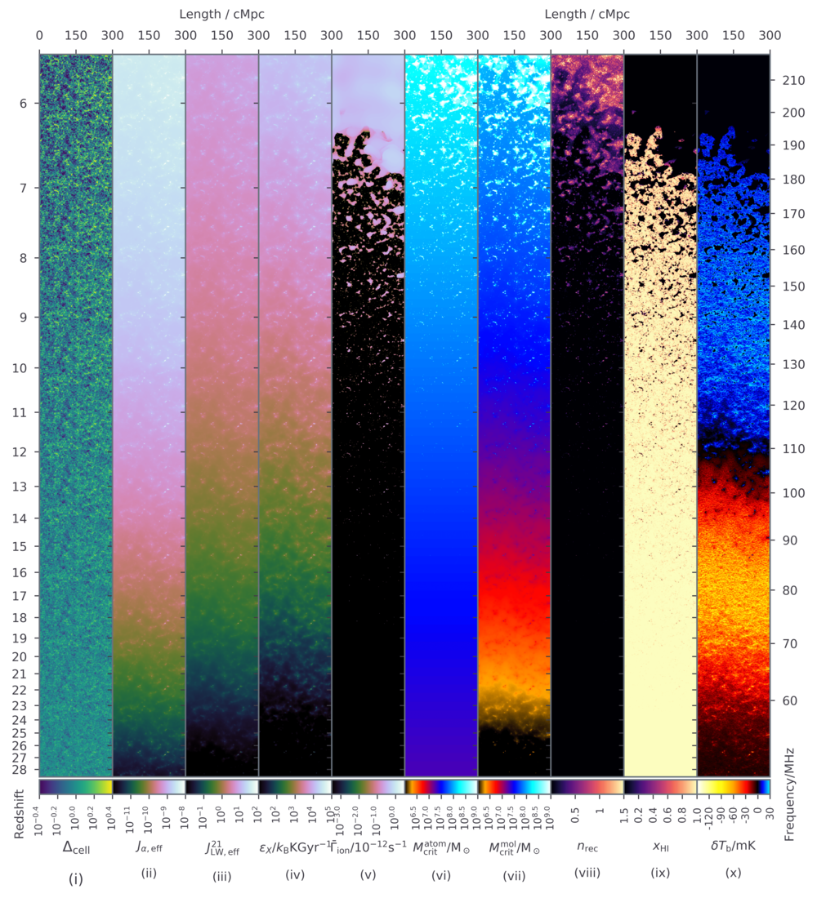

========
21cmFAST
========

.. start-badges
.. image:: https://travis-ci.org/21cmFAST/21cmFAST.svg
    :target: https://travis-ci.org/21cmFAST/21cmFAST
.. image:: https://coveralls.io/repos/github/21cmFAST/21cmFAST/badge.svg
    :target: https://coveralls.io/github/21cmFAST/21cmFAST
.. image:: https://img.shields.io/badge/code%20style-black-000000.svg
    :target: https://github.com/ambv/black
.. image:: https://readthedocs.org/projects/21cmfast/badge/?version=latest
    :target: https://21cmfast.readthedocs.io/en/latest/?badge=latest
    :alt: Documentation Status
.. image:: https://img.shields.io/conda/dn/conda-forge/21cmFAST
    :target: https://github.com/conda-forge/21cmfast-feedstock
    :alt: Conda
.. end-badges

**A semi-numerical cosmological simulation code for the radio 21-cm signal.**

This is the official repository for `21cmFAST`: a semi-numerical code that is able to
produce 3D cosmological realisations of many physical fields in the early Universe.
It is super-fast, combining the excursion set formalism with perturbation theory to
efficiently generate density, velocity, halo, ionization, spin temperature, 21-cm, and
even ionizing flux fields (see the above lightcones!).
It has been tested extensively against numerical simulations, with excellent agreement
at the relevant scales.

`21cmFAST` has been widely used, for example, by the Murchinson Widefield Array (MWA),
LOw-Frequency ARray (LOFAR) and Hydrogen Epoch of Reionization Array (HERA), to model the
large-scale cosmological 21-cm signal. In particular, the speed of `21cmFAST` is important
to produce simulations that are large enough (several Gpc across) to represent modern
low-frequency observations.

As of `v3.0.0`, `21cmFAST` is conveniently wrapped in Python to enable more dynamic code.

New Features in 3.0.0+
======================

* Robust on-disk caching/writing both for efficiency and simplified reading of
  previously processed data (using HDF5).
* Convenient data objects which simplify access to and processing of the various density
  and ionization fields.
* De-coupled functions mean that arbitrary functionality can be injected into the process.
* Improved exception handling and debugging
* Comprehensive documentation
* Comprehensive test suite.
* Strict `semantic versioning <https://semver.org>`_.

Installation
============
We support Linux and MacOS (please let us know if you are successful in installing on
Windows!). On these systems, the simplest way to get `21cmFAST` is by using
`conda <https://www.anaconda.com/>`_::

    conda install -c conda-forge 21cmFAST

`21cmFAST` is also available on PyPI, so that `pip install 21cmFAST` also works. However,
it depends on some external (non-python) libraries that may not be present, and so this
method is discouraged unless absolutely necessary. If using `pip` to install `21cmFAST`
(especially on MacOS), we thoroughly recommend reading the detailed
`installation instructions <https://21cmfast.readthedocs.io/en/latest/installation.html>`_.

Basic Usage
===========
``21cmFAST`` can be run both interactively and from the command line (CLI).

Interactive
-----------
The most basic example of running a (very small) coeval simulation at a given redshift,
and plotting an image of a slice through it::

    >>> import py21cmfast as p21c
    >>> coeval = p21c.run_coeval(
    >>>     redshift=8.0,
    >>>     user_params={'HII_DIM': 50, "USE_INTERPOLATION_TABLES": False}
    >>> )
    >>> p21c.plotting.coeval_sliceplot(coeval, kind='brightness_temp')

The coeval object here has much more than just the ``brightness_temp`` field in it. You
can plot the ``density`` field, ``velocity`` field or a number of other fields.
To simulate a full lightcone::

    >>> lc = p21c.run_lightcone(
    >>>     redshift=8.0,
    >>>     max_redshift=15.0,
    >>>     init_box = coeval.init_struct,
    >>> )
    >>> p21c.plotting.lightcone_sliceplot(lc)

Here, we used the already-computed initial density field from ``coeval``, which sets
the size and parameters of the run, but also means we don't have to compute that
(relatively expensive step again). Explore the full range of functionality in the
`API Docs <https://21cmfast.readthedocs.io/en/latest/reference/py21cmfast.html>`_,
or read more `in-depth tutorials <https://21cmfast.readthedocs.io/en/latest/tutorials.html>`_
for further guidance.

CLI
---
The CLI can be used to generate boxes on-disk directly from a configuration file or
command-line parameters. You can run specific steps of the simulation independently,
or an entire simulation at once. For example, to run just the initial density field,
you can do::

    $ 21cmfast init --HII_DIM=100

The (quite small) simulation box produced is automatically saved into the cache
(by default, at ``~/21cmFAST-cache``).
You can list all the files in your cache (and the parameters used in each of the simulations)
with::

    $ 21cmfast query

To run an entire coeval cube, use the following as an example::

    $ 21cmfast coeval 8.0 --out=output/coeval.h5 --HII_DIM=100

In this case all the intermediate steps are cached in the standard cache directory, and
the final ``Coeval`` box is saved to ``output/coeval.h5``. If no ``--out`` is specified,
the coeval box itself is not written, but don't worry -- all of its parts are cached, and
so it can be rebuilt extremely quickly. Every input parameter to any of the
`input classes <https://21cmfast.readthedocs.io/en/latest/reference/_autosummary/py21cmfast.inputs.html>`_
(there are a lot of parameters) can be specified at the end of the call with prefixes of
``--`` (like ``HII_DIM`` here). Alternatively, you can point to a config YAML file, eg.::

    $ 21cmfast lightcone 8.0 --max-z=15.0 --out=. --config=~/.21cmfast/runconfig_example.yml

There is an example configuration file `here <user_data/runconfig_example.yml>`_ that you
can build from. All input parameters are
`documented here <https://21cmfast.readthedocs.io/en/latest/reference/_autosummary/py21cmfast.inputs.html>`_.

Documentation
=============
Full documentation (with examples, installation instructions and full API reference)
found at https://21cmfast.readthedocs.org.

Acknowledging
=============
If you find `21cmFAST` useful in your research please cite at least one of the following
(whichever is most suitable to you):

    Andrei Mesinger and Steven Furlanetto, "Efficient Simulations of Early Structure
    Formation and Reionization", The Astrophysical Journal, Volume 669, Issue 2,
    pp. 663-675 (2007),
    https://ui.adsabs.harvard.edu/link_gateway/2007ApJ...669..663M/doi:10.1086/521806

    Andrei Mesinger, Steven Furlanetto and Renyue Cen, "21CMFAST: a fast, seminumerical
    simulation of the high-redshift 21-cm signal", Monthly Notices of the Royal
    Astronomical Society, Volume 411, Issue 2, pp. 955-972 (2011),
    https://ui.adsabs.harvard.edu/link_gateway/2011MNRAS.411..955M/doi:10.1111/j.1365-2966.2010.17731.x
