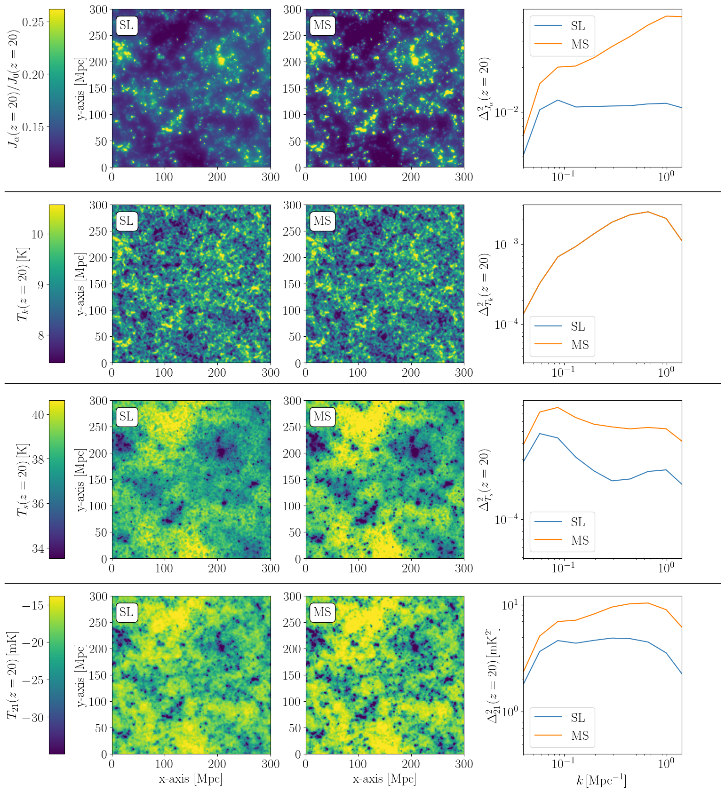
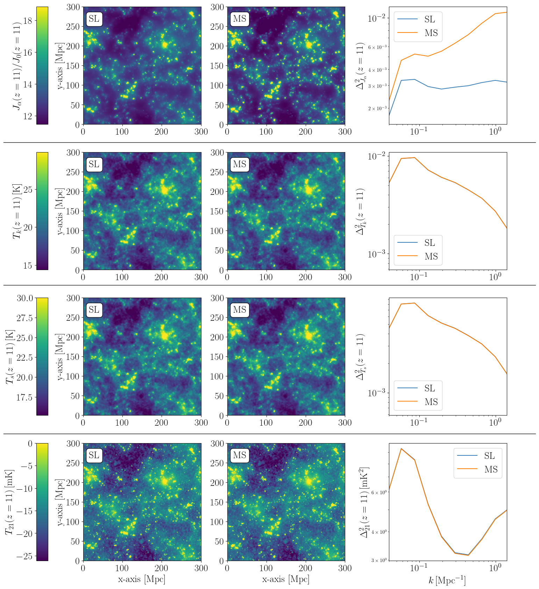

Description of Physical Models
==============================

``21cmFAST`` supports many physical models and effects that can often be toggled on or
off interchangeably (though some depend on others). The
:class:`~py21cmfast.MatterOptions` and
:class:`~py21cmfast.AstroOptions` classes contain all of the flags
that control which models to include in the simulation.

Below we provide a brief explanation on how some of the flags modify the output of
``21cmFAST``.

Models of the Matter Field
--------------------------

The parameters and flags of :class:`~py21cmfast.MatterOptions`
are used to control how cosmological matter fields (e.g. densities, velocities and halo
properties) are evaluated in the simulation.

Source Model
~~~~~~~~~~~~

.. note:: Set with the ``SOURCE_MODEL`` parameter of :class:`~py21cmfast.MatterOptions`.

To be filled.

Astrophysical Models
--------------------

The parameters and flags of :class:`~py21cmfast.AstroOptions`
are used to control how astrophysical quantities (e.g. star formation rate, UV and
ionizing radiation) are evaluated in the simulation.

It is important to stress that the generation of
:class:`~py21cmfast.PerturbedField` and
:class:`~py21cmfast.HaloCatalog` objects do not depend on these
parameters (nor on :class:`~py21cmfast.AstroParams`). Therefore, if
the cache contains :class:`~py21cmfast.PerturbedField` and
:class:`~py21cmfast.HaloCatalog` objects that had been previously
generated with a different set of :class:`~py21cmfast.AstroOptions`, these objects will
be loaded from the cache, instead of being re-evaluated.
This architecture allows one to quickly simulate different astrophysical models, given a
cosmological model.

Spin Temperature Fluctuations
~~~~~~~~~~~~~~~~~~~~~~~~~~~~~

To be filled.

Minihalos
~~~~~~~~~

To be filled.

Multiple Scattering of Lyman Alpha Photons
~~~~~~~~~~~~~~~~~~~~~~~~~~~~~~~~~~~~~~~~~~

.. note:: Toggled with the ``LYA_MULTIPLE_SCATTERING`` flag of
   :class:`~py21cmfast.AstroOptions` (default: ``False``).

The physical effect that enables the absorption feature in the 21-cm signal during
cosmic dawn is the strong coupling between the spin temperature and the gas kinetic
temperature. This coupling is obtained through Lyman alpha radiation that comes from the
first stars and is absorbed by the IGM. Since the cross section for the interaction
between photons near the Lyman alpha resonance frequency and HI atoms in the IGM has a
non-negligible width, the Lyman alpha photons that are absorbed by the IGM had not
traveled in straight lines, but rather had scattered along their path. This means that
the effective Lyman alpha emissivity that the IGM "sees" becomes more local, thereby
increasing the contrast in ``J_alpha`` (Lyman alpha flux) maps in the simulation, as can
be seen below. In the context of the 21-cm signal, this effect becomes negligible at
sufficiently low redshifts (normally below :math:`z<15`), once the spin temperature
completely follows gas kinetic temperature. For more information on this effect in the
simulation, see `Flitter, Munoz and Mesinger 2026 <https://arxiv.org/pdf/2601.14360>`_.

