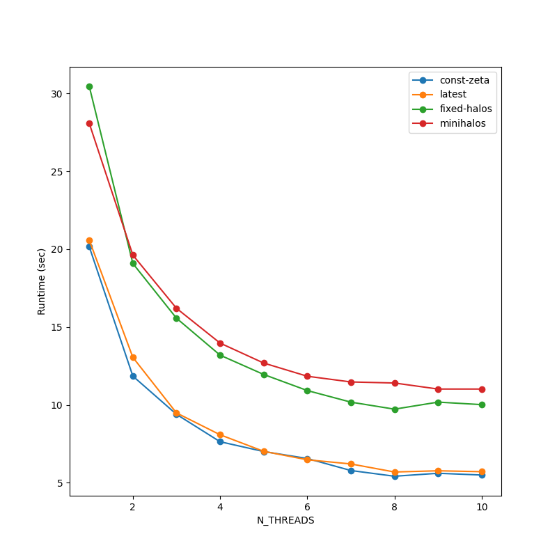
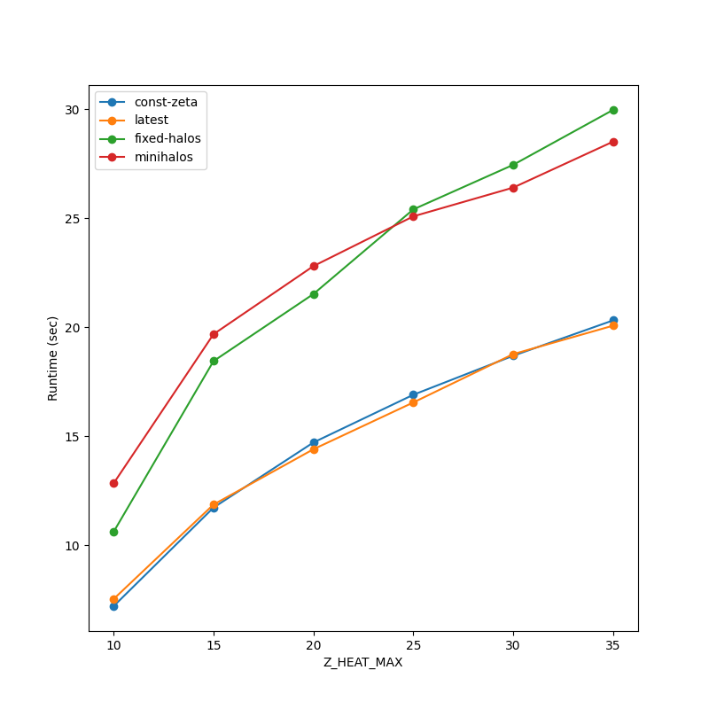
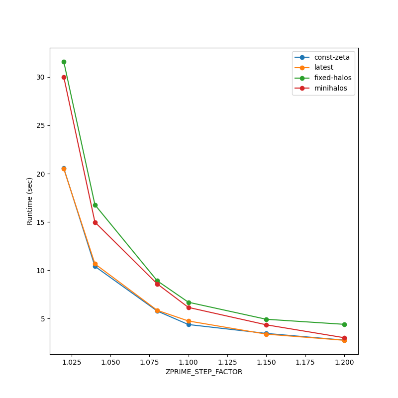

Performance
============

The runtime of ``21cmFAST`` depends on several sensitivity parameters. These include:

1. ``HII_DIM`` and ``DIM``. The higher these values, the more cells there are in the simulated box, namely more calculations are performed per redshift iteration.

2. ``Z_HEAT_MAX``. The higher this parameter, the simulation begins from a higher redshift.

3. ``ZPRIME_STEP_FACTOR``. The closer this parameter to 1, the more redshift iterations there are. Together with ``Z_HEAT_MAX`` (and the minimum redshift of the simulation), these parameters determine the number of redshift iterations in the simulations.

4. ``N_STEP_TS``. The higher this parameter, the more shells are evaluated in the computation of the radiation fields (e.g. Ly $\\alpha$ flux, necessary for the evaluation of the spin temperature).

5. ``R_BUBBLE_MAX``, ``R_BUBBLE_MIN`` and ``DELTA_R_HII_FACTOR``. These three parameters (together with box and cell dimensions) determine the number of ionized bubble radii to consider in the excursion-set algorithm.

6. ``N_THREADS``. The higher this number, the more cpus (threads) participate in the calculation.

Roughly speaking, the total amount of time of the 2LPT calculation in ``21cmFAST`` scales like ``DIM^3 * N_z / N_THREADS``, where ``N_z`` is the number of redshift iterations. The total amount of time for the calculation of the spin temperature scales like ``HII_DIM^3 * N_z * N_R / N_THREADS``, where ``N_R`` is ``N_STEP_TS``. A similar formula can be used to crudely estimate the total amount of time that is needed for the reionization computations, though here ``N_R`` refers to the number of ionized bubble radii.

The total runtime is also affected by the flag and parameter configurations, e.g. whether there are discrete halos in the simulation, and whether
mini-halos are taken into account.

Coeval runtime performance
--------------------------
To be filled.

Lightcone runtime performance
-----------------------------
To be filled.

Global evolution runtime performance
------------------------------------
The following plots were obtained by running ``21cmFAST`` on a Macbook Pro with a processor of 2.3 GHz 8-Core Intel Core i9.
The default parameter values that were considered were ``N_THREADS=1``, ``Z_HEAT_MAX=35`` and ``ZPRIME_STEP_FACTOR=1.02``.
Note that the runtime of the global evolution does not depend on ``HII_DIM`` nor on ``DIM`` as we have in that simulation only one cell!

The script to make these plots can be found `here <./performance/performance_global_evolution.py>`_.

``N_THREADS``
~~~~~~~~~~~~~

Higher ``N_THREADS`` tends to lower the total runtime. Interestingly, this trend exists even though we use
only one cell in the simulation. The reason for this is because multiprocessing is also used in the evaluation of the shells in the computation
of the spin temperature.

``Z_HEAT_MAX`` and ``ZPRIME_STEP_FACTOR``
~~~~~~~~~~~~~~~~~~~~~~~~~~~~~~~~~~~~~~~~~

As expected, we can see that higher ``Z_HEAT_MAX`` and lower ``ZPRIME_STEP_FACTOR`` tend to increase the total runtime (the more redshift iterations
the more time needed for the simulation to complete).
